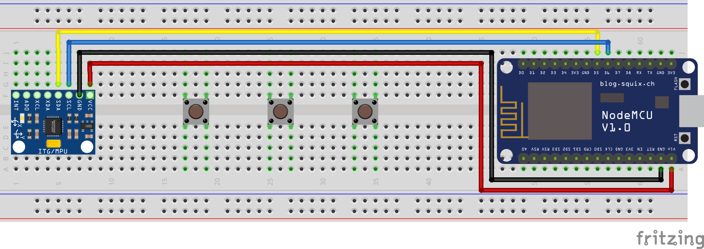

# DIY-Lightsaber
Creating a custom lightsaber from scratch

### The goal
The goal for this project is to create a custom lightsaber for my girlfriend. I've seen hundreds of cheap bad and expensive good ones and because of this I wanted to try to make my own. This will be a fun and educational project for me.

### Requirements
- NodeMCU ESP8266   (The main logic board)
- MPU-6050          (Accelerometer)

### Fritzing Sketch
